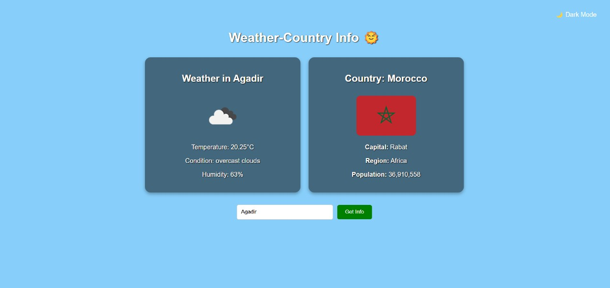

# 🌦️ Weather & Country Info App

A responsive React application that displays current weather information and detailed country data based on user input. Supports dark/light mode and remembers your last searched city.

---

## 🚀 Features

- 🌤️ Current weather: temperature, condition, humidity
- 🌍 Country info: capital, region, population, flag
- 🌗 Dark/Light mode toggle
- 💾 Remembers your last searched city (localStorage)
- 🔒 Secure API key using `.env`
- 📱 Fully responsive design

---

## 🖥️ Demo

 

---

## ⚙️ Getting Started

### 1. Clone the repository

```bash
git clone https://github.com/your-username/weather-country-app.git
cd weather-country-app
```

### 2. Install dependencies

```bash
npm install
```

### 3. Add API Key

Create a `.env` file in the project root and add your OpenWeatherMap API key:

```
REACT_APP_WEATHER_API_KEY=your_api_key_here
```

> ✅ Make sure `.env` is included in `.gitignore`

### 4. Start the app

```bash
npm start
```

App will run at [http://localhost:3000](http://localhost:3000)

---

## 📁 Project Structure

```
weather-country-app/
├── public/
│   └── index.html
├── src/
│   ├── App.js
│   ├── App.css
│   └── index.js
├── .env
├── .gitignore
├── package.json
└── README.md
```

---

## 🛠️ Built With

- [React](https://reactjs.org/)
- [OpenWeatherMap API](https://openweathermap.org/api)
- [REST Countries API](https://restcountries.com/)

---

## 📦 Deployment

This app can be deployed to platforms like:

- [Vercel](https://vercel.com/)
- [Netlify](https://www.netlify.com/)
- [GitHub Pages](https://pages.github.com/)

Make sure to set your environment variable `REACT_APP_WEATHER_API_KEY` in your hosting dashboard.


---

## 🙋 Author

Created by **Chaouki**  
GitHub: [@Chaouki33](https://github.com/Chaouki33)  

---

_ last Update on April 11, 2025_
